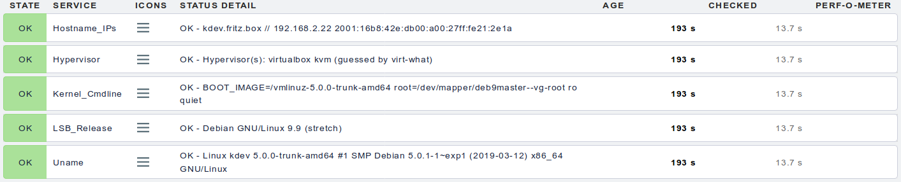
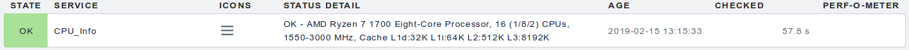
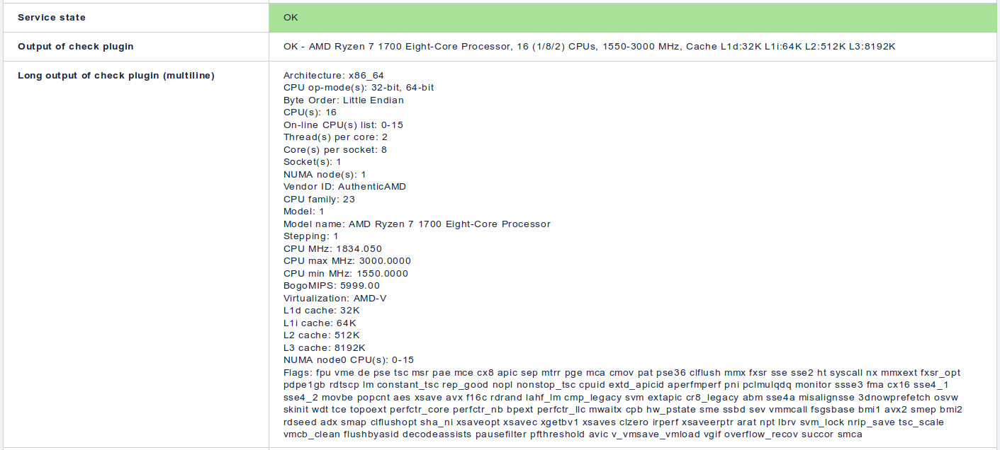
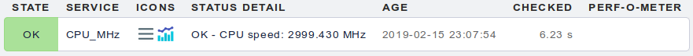
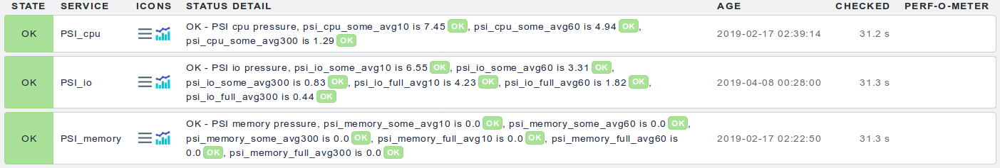
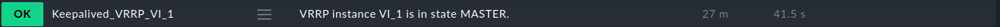
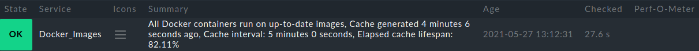
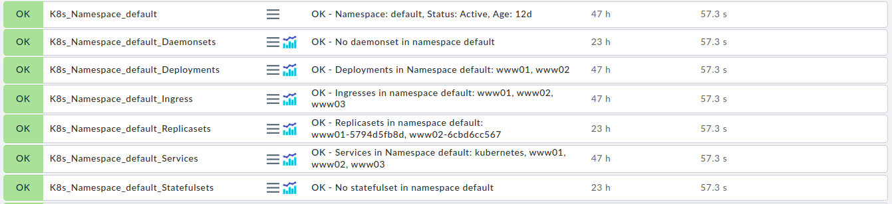
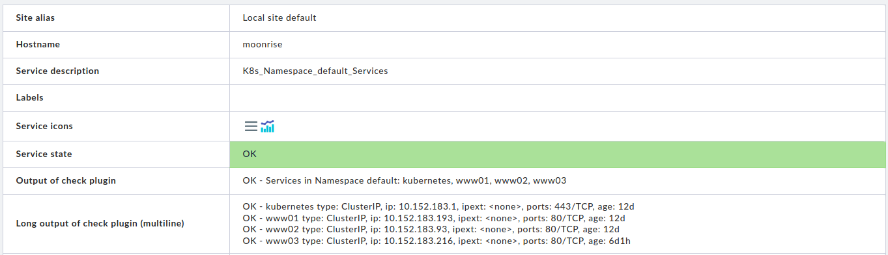

# Checkmk goodies

Some useful Linux checks and integrations for the [Checkmk](https://checkmk.com)
monitoring system.

Most of the scripts are
[Checkmk local checks](https://checkmk.com/cms_localchecks.html).
They are used together with the Checkmk Linux agent.

**Some of the local scripts do not work with Checkmk 2.0.0 and 2.0.0p1, due
to a bug in the "local" check plugin.**
Use Checkmk version 2.0.0p2 or newer, and ensure to install the latest Linux
agent on all monitored systems. The checks are no longer compatible
to Checkmk 1.6 or older versions. The autobp script requires at least Checkmk
2.1.

## Installation

To use the Local Check scripts, you need to install the
[Linux Agent for Checkmk](https://checkmk.com/cms_agent_linux.html).

Put the scripts under the "local" directory of the Linux agent, which is
`/usr/lib/check_mk_agent/local` on most systems. (When using CentOS/Red Hat and
installing the agent from the EPEL repositories, the directory is
`/usr/share/check-mk-agent/local`.) The scripts must be executable by the
Checkmk agent (e.g. `chmod 755 <Checkname>`).

## autopb (automatic piggyback host creation)

The `autopb` script is not a local check, but a cron job which runs under
the Checkmk site user. It automatically creates missing host objecs in Checkmk
when piggyback data ia available. See the [autopb](autopb/) directory for more
information.

## osinfo

This shell script makes some informations about the Linux OS available to
the Checkmk monitoring console. Those are:

* [uname](https://linux.die.net/man/1/uname) system and kernel information
* [lsb_release](https://linux.die.net/man/1/lsb_release) information about the
  installed Linux distribution
* [hostname](http://man7.org/linux/man-pages/man1/hostname.1.html) output
  about the system name and IP addresses
* The kernel command line arguments use for booting (from /proc/cmdline)
* The hypervisor, if the system is running under a hypervisor or
  container technology, and the
  [virt-what](http://people.redhat.com/rjones/virt-what/) tool is installed

The check status is always OK, entries in the monitoring console will never
get yellow or red.

The output of the osinfo script is rather static. It is therefore sufficient
to check it once an hour or even less. This can be achieved by putting the
script in a subdirecory called '3600', where the name denotes the number
of seconds until a cached output is renewed.

Example output in Checkmk console:

## lscpu

This Perl script parses the output of the [lscpu](https://linux.die.net/man/1/lscpu)
command and makes it available on the Checkmk console. It displays the
CPU model, number of topology of virtual processors, minimum and maximum
CPU frequencies in MHz, and the size of the CPU caches.

The long (multiline) output of the check contains the whole output of the
lscpu command.

The output of the lscpu script is also rather static, it is usually sufficient
to cache it for one hour or more.

Example output in Checkmk console:

## cpulevel

This Python script resolves wether the CPU complies to the x86-64-v1, v2, v3 or v4
specifications, as defined by the
[x86-64 microarchitecture levels](https://en.wikipedia.org/wiki/X86-64#Microarchitecture_levels).

The check result is WARN if the CPU level cannot be determined (eg. if /proc/cpuinfo cannot be
read, or if the CPU has another architecture than x86_64). Otherwise, is is OK.

## mhz

The ''mhz'' handles the "CPU MHz" output of the [lscpu](https://linux.die.net/man/1/lscpu)
command, which is usually the current frequency of the first processor. On modern
processors, the frequency is dynamically adjusted according to the system load.
The output is therefore dynamic, the script should be executed on every Checkmk
agent run.

The output also contains performance data, so Checkmk shows up the history
of the mhz value as a diagram.

Note that the script is usually executed in a series of other scripts/programs
started by the Linux agent. The measured CPU frequency can therefore be higher
than the average on the system.

Example output in Checkmk console:

## psi (Pressure Stall Informations)

This local check script handles the new
[pressure stall information (PSI)](https://www.kernel.org/doc/html/latest/accounting/psi.html)
in the Linux kernel ≥ 4.20. It generates three check items for CPU, memory
and I/O pressure each. Each item outputs two performance values about the
average pressure (in percent) in the last 60 and 300 seconds. (The PSI also
contain a value about the last 10 seconds, but the check omits them, due to the
default Checkmk check interval of 60s.)

The memory and I/O checks give "some" and "full" values, where "some" means
that at least one process is stalled through memory or I/O pressure, while
"full" means that all processes are stalled. The CPU check has only "some"
values, as it is impossible that all processes are stalled due to CPU pressure.
(Newer kernel versions also report "full" values for CPU pressure, but the data
is always zero. The check script hence filters them out.)

Some later kernels also report IRQ pressure, e.g. from RHEL 9 and derivates. Note
that on RHEL 9, PSI are switched off by default; to enable them, use the kernel
cmdline parameter `psi=1`.

See [Tracking pressure-stall information](https://lwn.net/Articles/759781/),
[psi: pressure stall information for CPU, memory, and IO v2](https://lwn.net/Articles/759658/)
and
[Linux Pressure Stall Information (PSI) by Example](https://unixism.net/2019/08/linux-pressure-stall-information-psi-by-example/)
for details on how pressure stall infomation work.

As the output of this check is very dynamic, it should not be cached by the
agent (e.g. put it in the local script directory, not one of it's
subdirectories.)

The default thresholds for the "some" values are 90%/95% with the 60s interval
and 80%/90% with the less volatile 300s interval. For the "full" value, the
60s thresholds are 80%/90%, and 60%/80% with 300s. The thresholds can be
changed according to your needs at the beginning of the script.

Example output in Checkmk console:

(Note that the image shows an older version of this check, containing also
10s average values.)

## yum_updates

On a CentOS, Red Hat, Oracle Linux or similar system with the
[yum](https://en.wikipedia.org/wiki/Yum_(software)) command installed,
this script checks for available security updates. The state is CRIT (red)
if there are pending security updates, and OK (green) otherwise.

The check consumes a small but measureable CPU load. I'd recommend to put it
in a subdirectory named 900, so the check is executed only once in 15 minutes.

Note that Checkmk comes with agent plugins for APT (Debian/Ubuntu) and Zypper
(SUSE) security updates. They just need to be installed in the `plugins`
subdirectory of the Checkmk agent. That's why the local check here does not
consider Debian/Ubuntu or SUSE systems.

## reboot

This script checks if a reboot is pending after package installations or updates.
Only the Red Hat family and Debian/Ubuntu and derivates are supported.

Under Red Hat, the check evaluates the output of the `needs-restarting -r`
command. On Debian-like systems, the files `/run/reboot-required` and
`/run/reboot-required.pkgs` are evaluated, according to [section 9.12 of the
Debian Policy Manual](https://www.debian.org/doc/debian-policy/ch-opersys.html#signaling-that-a-reboot-is-required).

## wireguard

This is a local script to monitor [Wireguard VPN](https://www.wireguard.com/)
interfaces and peers. For each interface, a check item is displayed. The state
is always OK. The check description shows the listening port number, the public
key, and the number of configured and active peers.

The performance value of this check contains the number of active peers.
A peer is considered active if the latest valid handshake is not older than
five minutes.

## agentfiles

When monitoring hosts with a Checkmk agent, a Checkmk server connects to the
agent and receives the raw monitoring data from the agent. Typically, the
agent output size is in the range of some kilobytes. But there is no upper
limit. By using malicious or badly designed plugins and local checks, the
output size can get huge, which slows down the checkmk server and makes it
consume large amounts of memory. When the hosts memory is exceeded, parts of
the Checkmk monitoring system can crash and need to be restarted. There is no
way of restricting the maximum allowed size of the agent output.

This local check should be installed on any Checkmk server with at least one
running site. It monitors the size of each cached Checkmk agent output file.
There is one check item for each installed checkmk site. The status is WARN or
CRIT if at least one cached agent file is larger than the configured thresholds,
which are 2MB and 16MB (warn/crit).

## keepalived (local check and notify script)

Checkmk has support for monitoring the states of keepalived VRRP instances.
However, it does only work when monitoring hosts with SNMP. Under Linux,
working with the Checkmk Linux agent is generally the preferred approach,
because it supports more checks right out of the box, and SNMP has security
and stability (timing) implications.

This check script offers an alternate approach to keepalived monitoring. As a
local check, it runs with the Checkmk Linux agent and does not require SNMP to
be active. The check comes with two files, a keepalived notification script and
a Checkmk local check. Some configuration is needed to get it running: a
keepalived instance notification script is added to notify the VRRP instance
state into a file under /var/run, and the local check reads it from here.

  1. In the keepalived configuration file `/etc/keepalived/keepalived.conf`,
     put the line `notify /etc/keepalived/keepalive_notify` into each
     VRRP_instance block that should be monitored.
  2. Copy the shell script `keepalived_notify` into the directory `/etc/keepalived/`
     and make it executable (`chmod 755 /etc/keepalived/keepalived_notify`).
  3. Copy the Perl script `keepalived` into the Checkmk agent local check
     directory (typically `/usr/lib/check_mk_agent/local`) and make it executable.
  4. Restart the keepalived service with `systemctl restart keepalived.service`.

The checks should now appear in the Checkmk console, one for each VRRP instance.

Caveats:

When manually deleting a VRRP instance from the keepalived config file,
its state file keeps lying around under /var/run. Delete it manually, or reboot
the machine to get the monitoring right again.

## dockerimages (Local check and Cron job)

These scripts check wether the running (or stopped) Docker containers run on
current or outdated images. The status is OK if all containers use current
images, and CRIT if at least one container runs on an image where a newer
version is available in the container registry.

The check consists of two scripts that must be used together:

* a cron job that fetches the current repository digests of all used docker
  images and stores them in a cache file, and
* a Checkmk Local Check thats matches the images of the available containers
  with the cached repodigests and creates the status output.

The script job `dockerimages_cron` needs to be run by cron, e.g. every couple
of hours. You can put it into the `/etc/cron.hourly` directory, or create a
separate cron job for it. The latter has the advantage that the job itselves
can be monitored with the `mk-job` utility:

	# file /etc/cron.d/dockerimages
	#
	# cache the repodigests every two hours
	15 */2 * * *  root  /usr/bin/mk-job dockerimages /root/bin/dockerimages_cron

The script requires the tools `skopeo` and `jq` to be installed under `/usr/bin`.
Install them with the tools of your Linux distribution. For Debian Linux 10
(buster), you might need to add the package sources of the Debian 11 (bullseye)
release.

This script `dockerimages` should be put in a subdirectory of the Local Check
directory, e.g. `300/dockerimages` to run it every five minutes. It reads the
cached repository digests and verifies the running containers against it.

Example output in Checkmk console:

When the check finds an outdated container, it needs to be recreated. For
this, pull the new image, stop and destroy the container, and start it again:

	# docker pull foo_image
	# docker stop foo_container
	# docker rm foo_container
	# docker run --name foo_container ... foo_image

Note that the check skips containers which do not yet have an entry in the
cache file, or where the container name is reused using an other image than
the cached one. The container will start to be checked after the next run
of the cron job.

If you run Docker, consider also to install the [official Checkmk agent plugin
for Docker](https://docs.checkmk.com/latest/en/monitoring_docker.html)
and use the [DCD piggyback connector](https://docs.checkmk.com/latest/en/dcd.html),
or the [autopb](autopb/) skript on the Checkmk Raw edition, to make monitoring
information for the containers available.

### Caveats

From time to time, it happens that an image gets a new repository digest
although its content did not change. In this case, the `docker pull`
command prints the output "Image is already up to date". In this case, it
is not neccessary to recreate the container; the Checkmk message will
disappear after the next check.

You can view such images with the docker command:

	# docker images --digests
	REPOSITORY  TAG       DIGEST                                                                    IMAGE ID       CREATED        SIZE
	[...]
	nextcloud   latest    sha256:6a80db1ed397cccae7f121a0c4aa8b65ec90c0ccc244f49861e7feacf42c2491   226698e20b65   5 days ago     868MB
	nextcloud   latest    sha256:6c4945e1e59fa0910306f3d3e04eaf088c92632e62e0bfd1e97b8bbd95411606   226698e20b65   5 days ago     868MB
	nextcloud   latest    sha256:b565e6133a900611492b62f9f359b225c08f144722904b6f09c1ecdb6ea798ac   226698e20b65   5 days ago     868MB
	nextcloud   latest    sha256:c481a4f63a631902c78b9c9147260209447903306c9f42556d99b90c0475829d   226698e20b65   5 days ago     868MB
	[...]

This is in fact the same image (same image ID, creation date and size), referenced
by four distinct repository digests. I believe this happens when a rebuilt image
that has not actually changed gets uploaded again.

This scripts should not be used on hosts that are part of a Kubernetes cluster.
On such hosts, the docker containers are managed and kept up-to-date by Kubernetes.
You might consider using the `k8s` local check explained below.

## k3s_version

When running [K3s](https://k3s.io/), the lightweight Kubernetes distribution from the
[CNCF](https://www.cncf.io/), this script checks if a newer version K3s than the installed
version is available upstream. It does this by downloading the K3s
[channel list](https://update.k3s.io/v1-release/channels) and comparing the latest stable
release against the output of `kubectl version`.

This check should be cached, e.g. for 15 minutes, as it downloads the channel list every
time it is executed. The status is OK when the versions match and WARN if a newer version
of K3s is available.

## k8s (Kubernetes)

The k8s local check script is an alternative approach to
[Kubernetes](https://kubernetes.io/) monitoring.

The Checkmk monitoring system (starting with version 1.5.0p12) already offers
a comprehensive monitoring solution for Kubernetes clusters, implemented by a
special agent and several checkplugins. However, they do not fit the needs of
all installations. The Checkmk Kubernetes plugins map each Kubernetes pod,
service, deployment and other entities to an own "host" using the piggyback
mechanism. This has several implications:

* The number of "hosts" generated by the Kubernetes plugins can be very huge.
  It is much work to create them manually and keep them up-to-date. One might
  want to enable the dynamic configuration daemon (DCD), but it is only present
  in the Checkmk enterprise edition. With the Checkmk raw (open source) edition,
  you need to create the hosts manually, or need 3rd party scripts like
  [autopb](autopb) to automate that.
* Even in a small Kubernetes cluster, the number of piggyback hosts quickly
  exceeds 25, which is the host limit for the Checkmk Free Edition.
* In a Kubernetes cluster, some entities come and go. This is always true for
  pods, as replaced pods have an other, randomly generated name. In an agile
  or development environment, this can be also true for deployments, services,
  ingresses etc. The DCD typically runs every hour or every 15 minutes, but
  pods appear and vanish much faster. You will receive a lot of UNKNOWN messages
  from Checkmk, though.
* The way of mapping Kubernetes entities to host names makes it hard to
  monitor more than one Kubernetes cluster on the same Checkmk server.
  Kubernetes system services from different clusters will appear under the
  same host name. You need complex translation rules to separate them.

In contrast to the buildin Kubernetes monitoring, the `k8s` local check offers
a rather conservative approach to Kubernetes monitoring.

The script is installed on one (or more) hosts of the Kubernetes cluster, or on
a separate control node which has access to the cluster. It requires the `kubectl`
binary and a KUBECONFIG file with the credentials to access the cluster and read
the informations on all nodes, namespaces, pods, services, deployments, ingresses,
statefulsets, daemonsets, and replicasets. The output consists of a quite constant
set of check items:

* one item for each
  [namespace](https://kubernetes.io/docs/concepts/overview/working-with-objects/namespaces/)
* one item for each [node](https://kubernetes.io/docs/concepts/architecture/nodes/)
* one item each for a summary of [pods](https://kubernetes.io/docs/concepts/workloads/pods/),
  pods by node, and pods by namespace
* one item each for a summary of all
  [services](https://kubernetes.io/docs/concepts/services-networking/service/),
  [deployments](https://kubernetes.io/docs/concepts/workloads/controllers/deployment/),
  [ingresses](https://kubernetes.io/docs/concepts/services-networking/ingress/),
  [statefulsets](https://kubernetes.io/docs/concepts/workloads/controllers/statefulset/),
  [daemonsets](https://kubernetes.io/docs/concepts/workloads/controllers/daemonset/), and
  [replicasets](https://kubernetes.io/docs/concepts/workloads/controllers/replicaset/)
* one item for each namespace and its services, deployments, ingresses,
  statefulsets, daemonsets, and replicasets

The number and names of the check items are constant, unless you add or remove
cluster nodes, or create/delete namespaces. This does happen rather seldom.
In this cases, the host(s) running the local check have to be rediscovered,
potentially by an automated discovery check. As long as nodes and namespaces
are unchanged, no rediscovery is needed.

Most of the check items are always in the state OK. An exception are the check
items for each namespace and deployment, statefulset, daemonset, and replicaset.
They compare the number of current, ready, and up-to-date entities to the
desired number of entities. The state is WARN when there are differences, and
CRITICAL when one of the numbers is zero but the desired number is greater.

For the check items of each namespace and its services, deployments, ingresses,
statefulsets, daemonsets, and replicasets, the long (multiline) output contains
a detailed list of the monitored Kubernetes entities. These checks also output
the number of configured entities as performance values. The summary check items
for nodes, namespaces and pods also output their respective counts as performance
values.

The check is installed by copying the `k8s` script to the local checks
directory, which is usually `/usr/lib/check_mk_agent/local`, and made
executable (`chmod 755 k8s`). The configuration values KUBECTL und KUBECONFIG
might have to be adapted to the own installation; in the current version, they
refer to a MicroK8s installation from the snap repository of an Ubuntu system.

The k8s Check was developed and tested using Kubernetes (and kubectl) version
1.19.0 and 1.18.8. Details might differ with other versions, thus some adaptions
might be needed.
